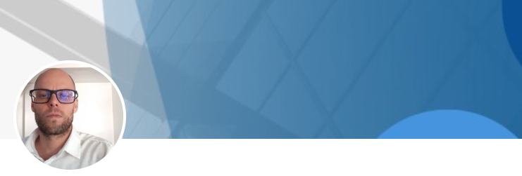

  

  <h1>Olá 👋, Eu sou Rodrigo Nogueira</h1>
  <h3>Um desenvolvedor full stack</h3>
  <h4>Sou desenvolvedor web. Trabalho com desenvolvimento web há alguns anos. Em resumo, minha jornada como desenvolvedor web ao longo do tempo tem sido incrivelmente enriquecedora. Aprendi a abraçar desafios, adotei as últimas tecnologias e evoluí constantemente minhas habilidades para proporcionar soluções web inovadoras. Gosto de criar experiências digitais significativas e estou sempre aberto a novas oportunidades que me permitam continuar contribuindo para o avanço da web.</h4>

<!-- TECHS -->

<h2 align="center">Habilidades</h2>

   
  
  
     
    
    
     
     
     
     
  

 

<!-- PROJECTS -->

<h2 align="center">Projetos</h2>

  <table>
    <tr>
          <td width="50%">
        <h3 align="center">Restaurante</h3>
        
  
          
           
           
          

              
            
          

          
<strong>HTML, CSS, React</strong>

          
Moderno website usando React.js

        

      </td>
      <td width="50%">
        <h3 align="center">GPT3</h3>
        
  
          
           
           
          

              
            	
          

          
<strong>React, GPT-3</strong>

          
Aplicação moderna usando React.js

        

      </td>
    </tr>
    <tr>
      <td width="50%">
        <h3 align="center">Viagem</h3>
        
  
          
           
           
          

              
            	
          

          
<strong>React, Next 13, Tailwind CSS</strong>

          
Website responsivo moderno

        
	
      </td>
      <td width="50%">
        <h3 align="center">HooBank</h3>
        
  
          
           
           
          

              
            
          

          
<strong>Next, React, CSS, Tailwind</strong>

          
React.js & Tailwind CSS

        

      </td>
    </tr>
  </table>

 
 

<!-- SOCIALS -->

<h2 align="center">Contato</h2>

&nbsp&nbsp&nbsp

<!-- STATS -->

<h2 align="center">Estatísticas</h2>
  

  
&nbsp;

  

 
